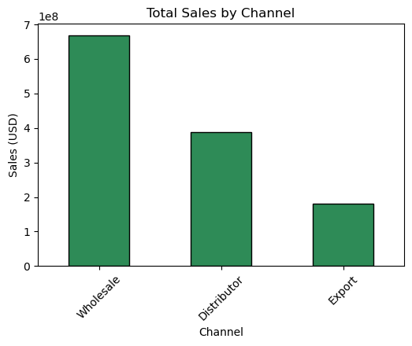
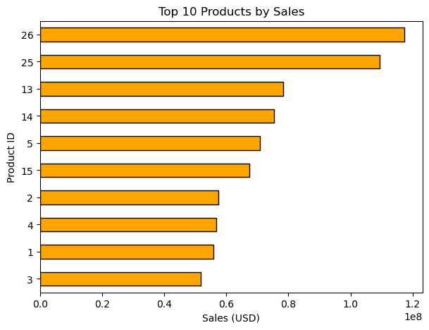
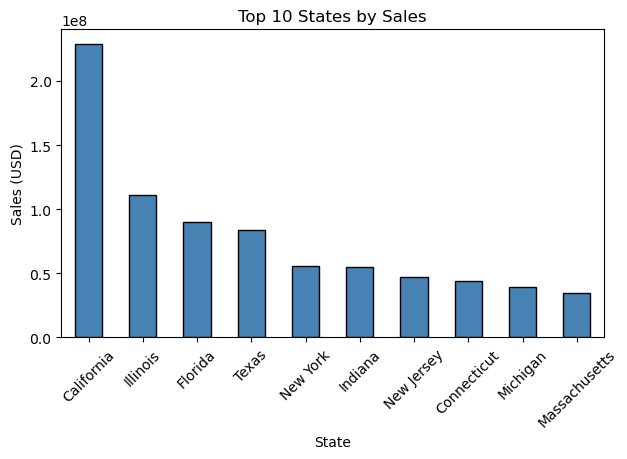

# Regional Sales Analysis – Exploratory Data Analysis (EDA)

This project was developed as part of the Codecademy Data Analytics with AI Bootcamp.  
The goal is to perform an **Exploratory Data Analysis (EDA)** on the Regional Sales Dataset  
to uncover trends, evaluate profitability, and provide actionable insights.


---

## 📊 Project Workflow
1. **Data Collection** – Import Regional Sales Dataset (2014–2018).  
2. **Data Understanding** – Explore dataset structure (Sales Orders, Customers, Products, Regions, Budgets).  
3. **Data Cleaning & Preparation** – Handle duplicates, validate datatypes, prepare for analysis.  
4. **Exploratory Data Analysis (EDA)** – Analyze sales trends, top products, channels, and regions.  
5. **2017 Budgets vs Actuals** – Compare planned vs actual sales.  
6. **Key Insights & Recommendations** – Summarize findings and propose strategies.  

---

## Project Structure

```
EDA-project/
├── Data/ # Dataset (Excel file and supporting data)
├── Docs/ # Assignment and documentation
│ └── Regional Sales Analysis - Exploratory Data Analysis.pdf
├── Notebooks/ # Jupyter notebooks (main analysis)
│ └── EDA.ipynb
├── Outputs/ # Graphs, tables, and exported results
├── Scripts/ # Optional Python scripts
├── README.md # Project description
├── requirements.txt # Required libraries
└── .gitignore # Files to ignore in Git
```


---

## 📈 Exploratory Data Analysis

The analysis was conducted in **Jupyter Notebook** and covers:  
- **Sales by Year** – Stable 2014–2016, sharp drop in 2018.  
- **Top Products** – Revenue concentrated in a few high-selling items.  
- **Sales by Channel** – One channel dominates revenue.  
- **Regional Performance** – California and Illinois lead, most states underperform.  
- **2017 Budgets vs Actuals** – Mixed results, with several products outperforming forecasts.

---

## 📊 Key Visuals

Below are some of the main visuals from the **Regional Sales Analysis (2014–2018)** project.

<p align="center">
  
  <br>
  <em>Figure 1: Total Sales Distribution by Sales Channel</em>
</p>

<p align="center">
  
  <br>
  <em>Figure 2: Top Products Ranked by Total Sales</em>
</p>

<p align="center">
  
  <br>
  <em>Figure 3: Highest Performing States in Sales Volume</em>
</p>

<p align="center">
  
  <br>
  <em>Figure 4: Comparison of 2017 Budgeted vs. Actual Sales</em>
</p>

---

- Sales peaked around 2014–2016 (~298M USD annually) but declined in 2018 (~48M USD).  
- The top 3 products account for a significant share of total revenue.  
- Strong dependency on a single channel poses strategic risks.  
- California and Illinois are the strongest regions, while smaller states add minimal value.  
- Several products exceeded their 2017 budgets, but some underperformed.  

---

## 💡 Recommendations

- **Diversify channels** to reduce dependency risk.  
- **Invest in high-performing products** and reassess low contributors.  
- **Expand in top regions** and explore opportunities in underperforming areas.  
- **Improve forecasting accuracy** to better align budgets with reality.  
- **Investigate the 2018 decline** to determine whether it is a data issue or a market downturn.  


## ⚙️ Requirements
This project was developed using Python 3.11 with the following libraries:
- pandas  
- matplotlib  
- seaborn  
- openpyxl  

Install dependencies with:
```bash
pip install -r requirements.txt
```

Author

Developed by Danny Chacón

Bootcamp: Codecademy – Data Analytics with AI 